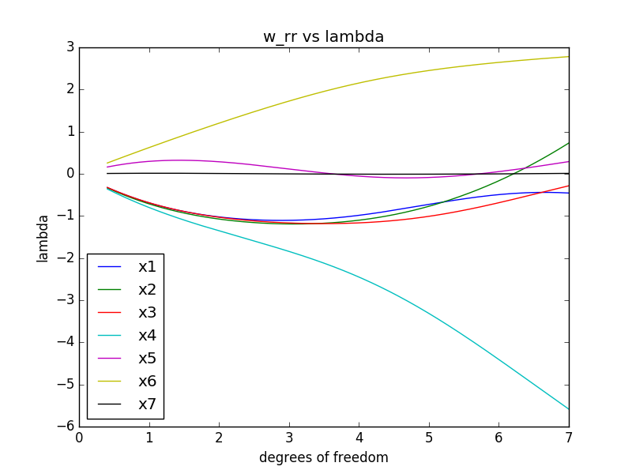
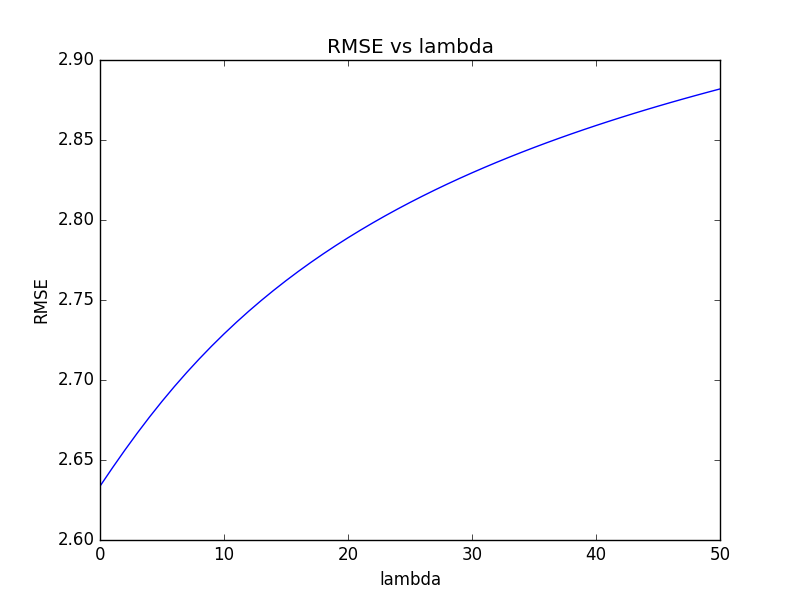
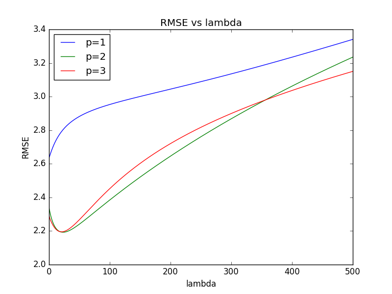

```{r setup, include=FALSE}
knitr::opts_chunk$set(echo = TRUE)
```

## Q1
# a)
$$
p(x_{1}...x_{n}|\pi_{i}) = \prod_{i=1}^{n}[\binom{x_{i}+r-1}{x_{i}}\pi^{x_{i}}(1-\pi)^r]
$$

# b)
$$
\sum_{i=1}^{n} \bigtriangledown_{\pi}\ln [\binom{x_{i}+r-1}{x_{i}} \pi^{x}(1-\pi)^{r}] = 0  
$$
$$
\sum_{i=1}^{n} \bigtriangledown_{\pi}\ln [\binom{x_{i}+r-1}{x_{i}} + x_{i} * ln(\pi) + r*ln(1-\pi)] = 0
$$

$$
 \sum_{i=1}^{n} (\frac{x_{i}}{\pi}-\frac{r}{1-\pi}) = 0
$$

$$ 
\bigtriangledown_{\pi}L = \frac{x}{r}+1+\frac{a-1}{\pi}-\frac{b-1}{1-\pi} = 0
$$

$$
\widehat{\pi}_{ML} = \frac{x}{r} + 1
$$

# c)
$$
Prior = p(\pi) = \frac{\Gamma(a+b)}{\Gamma(a)\Gamma(b)} \pi^{a-1} (1-\pi)^{b-1}
$$
$$
\widehat{\pi}_{MAP} = arg\ max_{\pi}\ln\ p(\pi|y,X) = arg \ max_{\pi} \ ln (\frac{p(y|\pi,X)p(\pi)}{p(y|X))})
$$
$$
\widehat{\pi}_{MAP} = arg\ max_{\pi} \ ln(p(y|\pi,X)) + ln(p(\pi))
$$
$$
\frac{b-1}{1-\pi} = \frac{r(a-1)+\pi x + \pi r}{\pi r}
$$
$$
r(1-a) = \pi(x-\pi x-rb-ra+3r-\pi r)
$$
$$
\widehat{\pi}_{MAP} = \frac{a-1}{a+b-2}
$$

# d)
$$
\prod_{i=1}^{n}[\binom{x_{i}+r-1}{x_{i}}\pi^{x_{i}}(1-\pi)^r] * p(\pi)
$$
It is now the beta posterior distribution

# e)
$$

$$

## Q2
# a)


# b)
That the 4th adn 6th dimensions are the most important factors in predicting y.

# c)
Well you want to minimize RMSE, and according to my graph that happens as lambda decreases to 0, so Ridge Regression is no better (same accuracy) than Least Squares for this.




# d)
Again I would want to minimize the RMSE, and the graph shows me that the 2nd and 3rd order have about the same RMSE at their lowest points. The ideal lambda changes for this as it is greater than 0 (roughly ~30), so Ridge Regression is more accurate in this case.

