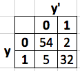
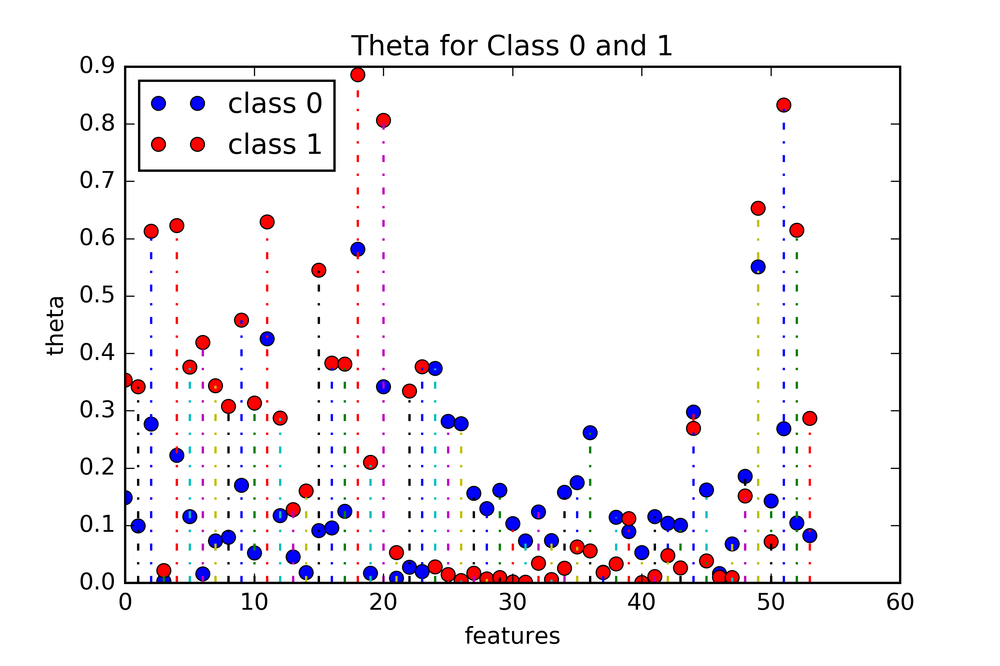
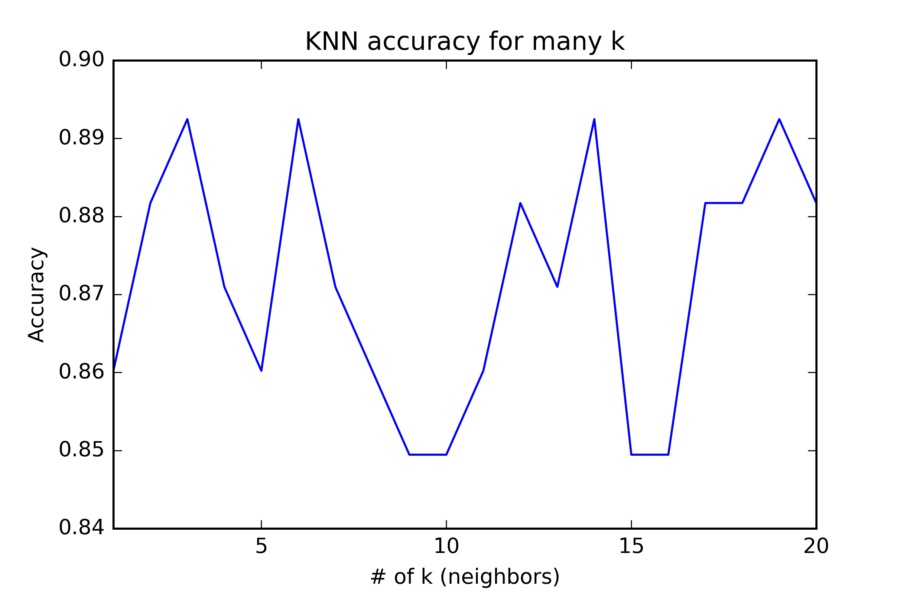

```{r setup, include=FALSE}
knitr::opts_chunk$set(echo = TRUE)
setwd('/Users/mikejaron/Google Drive/QMSS/Machine_Learning/hw2')
```
# 1)
## 1a)
$$
\sum_{i=1}^{n}ln \, p(y_{i} | \pi) \\ 
$$
$$
= \sum_{i=1}^{n} ln \, \pi^{y_{i}} \, (1-\pi)^{1-y_{i}} \\
$$
$$
= \sum_{i=1}^{n} y_{i} \, ln \, \pi + (1-y_i) \, ln (1-\pi) \\
$$
$$
\frac{\partial }{\partial \pi}(\sum_{i=1}^{n} y_{i} \, ln \, \pi + (1-y_i) \, ln (1-\pi)) = 0 \\
$$
$$
0 = \frac{\sum_{i=1}^{n} y_{i} }{\pi} - \frac{\sum_{i=1}^{n} (1-y_i) }{1-\pi} \\
$$
$$
\frac{\sum_{i=1}^{n} y_{i} }{\pi} = \frac{\sum_{i=1}^{n} (1-y_i) }{1-\pi} \\
$$
$$
(1-\pi)\sum_{i=1}^{n} y_{i} = \pi \sum_{i=1}^{n} (1-y_i) \\
$$
$$
(1-\pi)\sum_{i=1}^{n} y_{i} = \pi \, (n - \sum_{i=1}^{n} y_i) \\
$$
$$
\sum_{i=1}^{n} y_{i} - \pi \sum_{i=1}^{n} y_{i} = \pi \, n - \pi \sum_{i=1}^{n} y_i \\
$$
$$
\sum_{i=1}^{n} y_{i}  = \pi \, n \\
$$
$$
\hat{ \pi} = \frac{\sum_{i=1}^{n} y_{i}}{n}
$$

## 1b)
$$
\sum_{i=1}^{n}ln \, p(x_{i,1} | \theta_{y}^{1}) \\ 
$$
$$
= \sum_{i=1}^{n} ln \, (\theta_{y}^{1})^{x_{i,1}} \, (1-\theta_{y}^{1})^{1-x_{i,1}} \\
$$
$$
= \sum_{i=1}^{n} x_{i,1} \, ln \, \theta_{y}^{1} + (1-x_{i,1}) \, ln (1-\theta_{y}^{1}) \\
$$
$$
\frac{\partial }{\partial \theta_{y}^{1}}(\sum_{i=1}^{n} x_{i,1} \, ln \, \theta_{y}^{1} + (1-x_{i,1}) \, ln (1-\theta_{y_i}^{1})) = 0 \\
$$
$$
0 = \frac{\sum_{i=1}^{n} x_{i1} }{\theta_{y}^{1}} - \frac{\sum_{i=1}^{n} (1-x_{i,1}) }{1-\theta_{y}^{1}} \\
$$
$$
\frac{\sum_{i=1}^{n} x_{i1} }{\theta_{y}^{1}} = \frac{\sum_{i=1}^{n} (1-x_{i,1}) }{1-\theta_{y}^{1}} \\
$$
$$
(1-\theta_{y}^{1})\sum_{i=1}^{n} x_{i,1} = \theta_{y}^{1} \sum_{i=1}^{n} (1-x_{i,1}) \\
$$
$$
(1-\theta_{y}^{1})\sum_{i=1}^{n} x_{i,1} = \theta_{y}^{1} \, (n - \sum_{i=1}^{n} x_{i,1}) \\
v
\sum_{i=1}^{n} x_{i,1} - \theta_{y}^{1} \sum_{i=1}^{n} x_{i,1} = \theta_{y}^{1} \, n - \theta_{y}^{1} \sum_{i=1}^{n} x_{i,1} \\
$$
$$
\sum_{i=1}^{n} x_{i,1}  = \theta_{y}^{1} \, n \\
$$
$$
\hat{ \theta_{y}^{1}} = \frac{\sum_{i=1}^{n} x_{i,1}}{n} \\
$$
$$
=> \sum_{d=0}^{1} ( \hat{ \theta_{y_d}^{1}} = \frac{\sum_{i=1}^{n} x_{i,1}}{n} )
$$

## 1c)
$$
\sum_{i=1}^{n}ln \, p(x_{i,2} | \theta_{y}^{2}) \\ 
$$
$$
= \sum_{i=1}^{n}ln \, \theta_{y}^{2} ( x_{i,2})^{-(\theta_{y}^{2} + 1)} \\
$$
$$
= ln \, \theta_{y}^{2} + \sum_{i=1}^{n} ln ( x_{i,2})^{-(\theta_{y}^{2} + 1)} \\
$$
$$
= ln \, \theta_{y}^{2} -(\theta_{y}^{2} + 1) \, \sum_{i=1}^{n} ln \, ( x_{i,2}) \\
$$
$$
\frac{\partial }{\partial \theta_{y}^{2}}( ln \, \theta_{y}^{2} -(\theta_{y}^{2} + 1) \, \sum_{i=1}^{n} ln \, ( x_{i,2})) = 0 \\
$$
$$
0 = \frac{n}{\theta_{y}^{2}} - \sum_{i=1}^{n} ln(x_{i,2}) \\
$$
$$
\frac{n}{\theta_{y}^{2}} = \sum_{i=1}^{n} ln(x_{i,2}) \\
$$
$$
n = \sum_{i=1}^{n} ln(x_{i,2}) \theta_{y}^{2} \\
$$
$$
\hat{\theta_{y}^{2}} = \frac{n}{\sum_{i=1}^{n} ln(x_{i,2})} \\
$$
$$
=> \sum_{d=0}^{1} ( \hat{\theta_{y_d}^{2}} = \frac{n}{\sum_{i=1}^{n} ln(x_{i,2})} )
$$

# 2)
## 2a)

Accuracy = 92.5%

## 2b)
For the 16th feature, the word "free", and the 52nd feature, the "!", both have a higher probability to be in spam email than not. For the word free it has a probablilty of about 12% to be in a non spam email and about 39% to be in a spam email. For the "!" there is a probability of about 25% to be in a non spam email and about 84% to be in a spam email.


## 2c)



