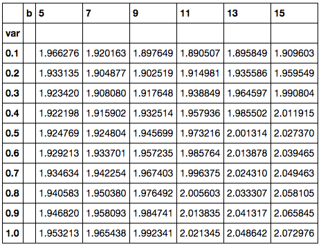
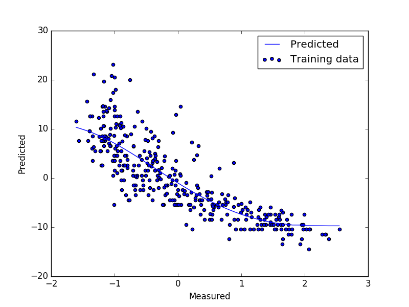
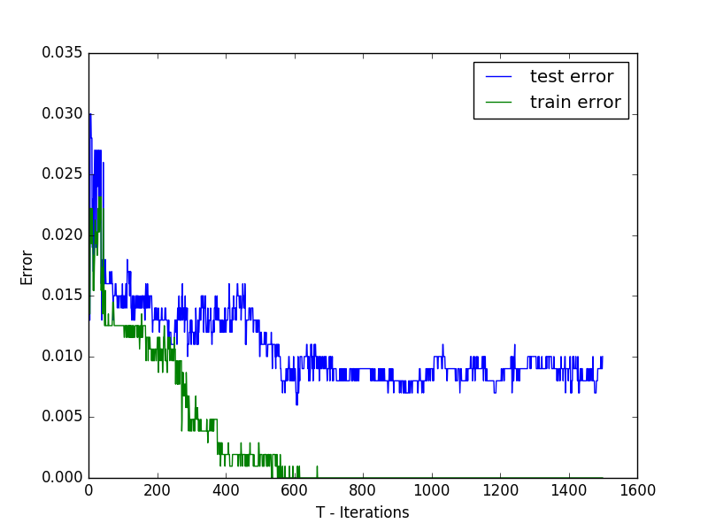
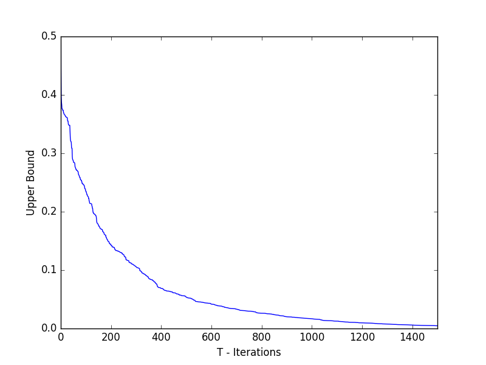
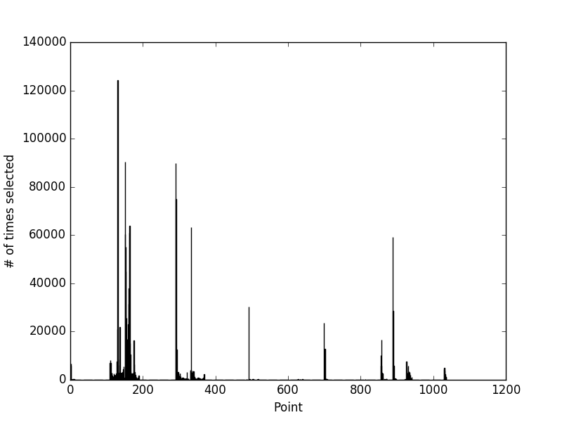
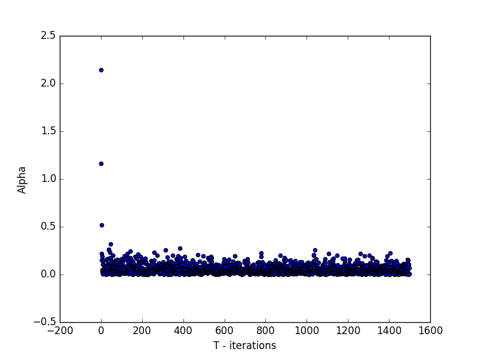
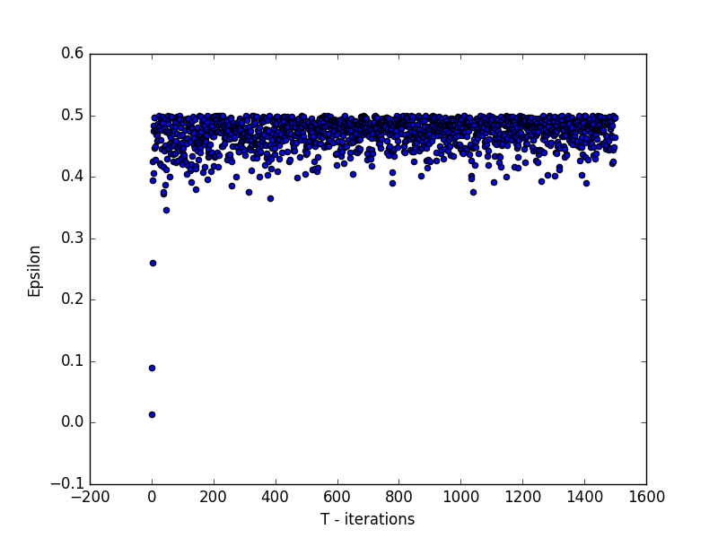

# mj2776

## 1. 
### a) 
```{python}
def kernals(x1, x2, b):
    kernal = np.zeros((len(x1),len(x2)))
    for i in range(len(x1)):
        for j in range(len(x2)):
            kernal[i][j] = np.exp((-1./b) * (np.linalg.norm([x1[i]] - x2[j], 2)**2))   
    return kernal

def predict(k_XX, k_Xx, var):
    a = np.linalg.inv(var * np.identity(len(k_XX)) + k_XX) 
    mu = np.dot(k_Xx, np.dot(a, y_train))
    return mu
```


### b)


### c)

The best values of this algorithm was at b = 11 & var = .1, with those parameters the RMSE was ~1.891. Some possible downsides of this approach vs. HW1, is that now we need to tune 2 different hyper-parameters vs in HW1, we only tuned 1, lambda. Also this approach is a little more complex and thus takes more time to run and to understand the importance of the features.


### d)



## 2.
### a)



### b)


### c)


### d)


